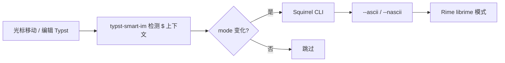

用 [Typst](https://typst.app/) 写笔记时，一个很常见的节奏是：**正文用中文**，**公式和符号用英文**。光标在 `$x^2$` 里要英文布局，移出 `$...$` 又要立刻回到中文——如果全靠 `Shift` 在 Rime 的 ASCII 模式（英文直出）和中文模式之间切换，长时间编辑很容易误触，小指也会很累。

这篇文章记录我摸索出来的一套方案：**不切换系统输入法**，而是让 [鼠须管（Squirrel）](https://github.com/rime/squirrel) 在 Rime 内部的 **ascii / nascii** 模式间切换；再用 VS Code 扩展根据 **Typst 编辑上下文** 自动调用 CLI。整体比较稳定，开销也小。

## 背景：Typst 里的「两种语言环境」

Typst 文档里至少有两类输入场景：

| 场景 | 典型内容 | 期望输入状态 |
|------|----------|--------------|
| 普通正文 | 中文叙述、列表、标题 | 中文模式（Rime **nascii**） |
| 行内/块级数学 | `$...$`、`$ ... $` 块 | 英文模式（Rime **ascii**，直出符号与字母） |

在 VS Code 里用 [Tinymist](https://github.com/Myriad-Dreamin/tinymist) 编辑 `.typ` 时，语言服务会给光标位置打上语义信息。例如行内数学附近，语义 token 往往带有 `modifiers: math`；普通内容则是 `text` 一类。理论上可以据此判断「现在该中文还是该英文」——后面介绍的 [vscode-smart-ime](#参考项目-vscode-smart-ime) 走的就是 **TextMate scope / 语义区域** 这条路。

我当前的实现则针对 Typst 做了更轻量的启发式（见 [Typst Smart IME](#typst-smart-ime扩展)），但对「数学区英文、正文中文」这个目标是一致的。

## 为什么不用「系统输入法切换」？

市面上有不少通过命令行切换 **macOS 当前输入法** 的工具，例如 IME Select、im-select，或各编辑器里的 IME 插件。我试过一段时间，体感问题比较集中：

1. **和 Rime 的内部状态不同步**  
   切到「中文输入法」后，Rime 有时仍停在 **ASCII 模式**（图标像英文），还得再按一次 `Shift`，等于多一步，也抵消了自动化的意义。鼠须管官方长期缺少从外部切换 ascii 模式的接口，相关讨论见 [rime/squirrel#774](https://github.com/rime/squirrel/issues/774)。

2. **对其他输入法副作用**  
   例如豆包输入法：切到英文后输入 UI 偶发不消失，属于 IME 层面的 bug，和「只改 Rime 模式」不是一类问题。

3. **性能与稳定性**  
   频繁查询、切换系统 TIS（Text Input Source）比调用本机 Rime 进程一条 CLI 更重，也更容易和焦点、远程窗口等行为打架。

Rime 本身就把 **ASCII 模式**（临时英文直出）和 **中文输入** 分成两种状态；我们真正需要的是在编辑器的语义边界上触发 **模式切换**，而不是在 ABC / 鼠须管 / 搜狗之间来回换。

## 关键拼图：鼠须管 CLI 的 `--ascii` / `--nascii`

[鼠须管](https://github.com/rime/squirrel) 是 Rime 在 macOS 上的官方前端。直到 2025 年，仍很难从外部程序可靠地设置「当前是否 ascii 模式」。

社区 PR [rime/squirrel#1070](https://github.com/rime/squirrel/pull/1070)（作者 [@Parsifa1](https://github.com/Parsifa1)）为 Squirrel 可执行文件增加了子命令，API 参考了 Windows 小狼毫的 [rime/weasel#1113](https://github.com/rime/weasel/pull/1113)，并关联了早期的 [PR #797](https://github.com/rime/squirrel/pull/797)、[#123](https://github.com/rime/squirrel/pull/123)。截至写作时 PR 仍 **未合并进官方 master**，需要自行 **cherry-pick 后编译** 安装。

合并后（或本地构建后）可用的 CLI 示例：

```bash
# 英文直出（ascii 模式）
"/Library/Input Methods/Squirrel.app/Contents/MacOS/Squirrel" --ascii

# 回到中文输入（nascii 模式）
"/Library/Input Methods/Squirrel.app/Contents/MacOS/Squirrel" --nascii

# 查询当前模式（输出 ascii / 其他）
"/Library/Input Methods/Squirrel.app/Contents/MacOS/Squirrel" --getascii
```

PR 讨论里也有人用 Neovim 的 `InsertEnter` / `InsertLeave` 配合 `--getascii` 做中英文恢复，见 [PR #1070 讨论区](https://github.com/rime/squirrel/pull/1070) 中的 Lua 示例（思路相同：离开插入时用 CLI 拉回 ascii）。

### 本地构建鼠须管（简要）

1. Clone [rime/squirrel](https://github.com/rime/squirrel)，checkout 你日常使用的版本。
2. Cherry-pick [PR #1070 的 commit](https://github.com/rime/squirrel/pull/1070)（`d8794f8` 一带）。
3. 按仓库 README 用 Xcode 编译，将生成的 `Squirrel.app` 安装到 `/Library/Input Methods/`（或用户目录，并相应修改扩展里的路径）。
4. 在终端验证：`Squirrel --getascii` 能返回当前模式，`--ascii` / `--nascii` 能即时改变候选栏与直出行为。

> 若你使用官方发行版且未打补丁，VS Code 扩展调用 CLI 会失败；状态栏扩展会给出一次性警告。

## 何时切换：VS Code 与 Typst Smart IME 扩展

VS Code 的扩展 API 可以在光标移动、选区变化、文档编辑时拿到 **活动编辑器** 和 **语言 ID**。结合 Typst 的语法结构，就能定义「当前应使用 ascii 还是 nascii」。

我在本地笔记仓库 **learnote** 里维护了一个 VS Code 扩展 **`typst-smart-im`**（路径：`_scripts/typst-smart-im`），只做一件事：**在 Typst 文件中根据光标是否在 `$...$` 内，debounce 后调用鼠须管 CLI**。

### 检测逻辑（当前实现）

实现刻意保持简单，避免依赖额外 grammar 包：

1. 取光标前的全文前缀，统计 `$` 的个数。
2. 若 `$` 个数为 **偶数**（成对闭合），认为光标在 **行内数学内** → `english` → `--ascii`。
3. 否则使用配置项 `typstSmartIM.defaultMode`（默认 `chinese`）→ `--nascii`。

对应核心代码：

```typescript
// 摘自 typstMode.ts：$ 成对则视为数学环境
if (prefix.split("$").length % 2 === 0) {
  return { mode: "english", matchKind: "heuristic", matchName: "inline-math" };
}
```

扩展还会在 **mode 实际变化** 时才调用 Squirrel（默认 debounce 200ms），避免每次按键都 exec，对性能和电池更友好。检测 debounce 50ms，切换 debounce 200ms，CLI 超时默认 1s。

### 配置项

| 键 | 默认值 | 说明 |
|----|--------|------|
| `typstSmartIM.enabled` | `true` | 总开关 |
| `typstSmartIM.defaultMode` | `chinese` | `$...$` 外的模式 |
| `typstSmartIM.squirrelPath` | 鼠须管 CLI 路径 | 自定义构建时改这里 |
| `typstSmartIM.switchDebounceMs` | `200` | 模式变化后调用 CLI 的 debounce |
| `typstSmartIM.switchTimeoutMs` | `1000` | CLI 超时 |
| `typstSmartIM.statusBarEnabled` | `true` | 状态栏显示「中 / EN」 |
| `typstSmartIM.debugLogging` | `false` | 输出通道调试日志 |

命令面板：`Toggle Typst Smart IME Switching`（`typst-smart-im.toggle`）。

### 安装扩展（本地）

```bash
cd /path/to/learnote/_scripts/typst-smart-im
npm install && npm run build
```

将编译结果以 VS Code 扩展方式加载（任选其一）：

- **开发宿主**：在该目录 `F5` 启动 Extension Development Host；或
- **拷贝到扩展目录**：把文件夹链到 `~/.vscode/extensions/typst-smart-im`，重启 VS Code。

确保工作区已安装 [Tinymist](https://marketplace.visualstudio.com/items?itemName=myriad-dreamin.tinymist)，且 `[typst]` 文件关联正确。我在 learnote 的 `.vscode/settings.json` 里开启了 `typstSmartIM.defaultMode: chinese`。

### 架构一览



与「切换系统输入法」相比，链路短：**编辑器 → 本机 Rime 前端 → 模式位**，没有 TIS 枚举，也没有 IME 切换动画。

### 已知限制

- 仅处理 **行内 `$...$`** 启发式；`#math.block(...)` 等块级公式若不用 `$` 包裹，需要以后扩展（例如读 Tinymist 的 semantic token 或 scope）。
- 字符串里的 `$` 可能误判；Typst 笔记里我尽量用 `#raw` 或转义避免正文中的裸 `$`。
- PR #1070 未进官方包前，需自备 Squirrel 构建。

## 参考项目：vscode-smart-ime

在写 Typst 专用扩展之前，我参考过 [OrangeX4/vscode-smart-ime](https://github.com/OrangeX4/vscode-smart-ime)（[VS Marketplace](https://marketplace.visualstudio.com/items?itemName=OrangeX4.vscode-smart-ime)）。它面向 **通用编程 / Markdown / LaTeX**，特性包括：

- 前一个字符是中文时自动切中文（可配间隔，默认 2s，**相对耗电**）；
- 中文后单空格切英文、英文后双空格切中文（可选）；
- 进入/离开 **comment**、**string**、**markup.math** 等 [scope](https://code.visualstudio.com/api/language-extensions/syntax-highlight-guide#scope-and-inspect-editor-tokens) 时切换；
- 纯英文文档、Vim Normal、远程窗口等禁用策略。

它依赖 [IME and Cursor](https://marketplace.visualstudio.com/items?itemName=beishanyufu.ime-and-cursor) 与 [HyperScopes](https://marketplace.visualstudio.com/items?itemName=draivin.hscopes)，通过配置的 `ObtainIMCmd` 获取当前输入法 key，再调用外部命令切换——和本文的 **Rime 内部 ascii 切换** 是不同层级的方案。

| 维度 | vscode-smart-ime | typst-smart-im（本文） |
|------|------------------|-------------------------|
| 目标场景 | 多语言代码、MD、TeX | Typst 笔记 |
| 切换对象 | 系统输入法 / IME key | 鼠须管 `--ascii` / `--nascii` |
| 上下文来源 | TextMate scope 前缀匹配 | `$` 成对启发式 |
| 依赖 | 多个扩展 + 外部 im 命令 | 打补丁的 Squirrel + Tinymist |
| 性能 | 部分特性轮询感强 | 仅在 mode 变化时 exec CLI |

对 Typst 这种 **数学与中文高频交替** 的介质，专用扩展 + Rime CLI 更贴需求；若你主要在 LaTeX/Markdown 里写，smart-ime 的 `markup.math,meta.math` 配置仍值得一看。

## 其他相关链接

| 资源 | 说明 |
|------|------|
| [rime/squirrel#774](https://github.com/rime/squirrel/issues/774) | 请求命令行切换中英文状态（本文 PR 试图关闭） |
| [rime/squirrel#1070](https://github.com/rime/squirrel/pull/1070) | `--ascii` / `--nascii` / `--getascii` |
| [rime/weasel#1113](https://github.com/rime/weasel/pull/1113) | Windows 小狼毫同类 API |
| [Myriad-Dreamin/tinymist](https://github.com/Myriad-Dreamin/tinymist) | Typst 语言服务器与 VS Code 集成 |
| [typst.app](https://typst.app/) | Typst 官方站点 |
| 本地 `learnote/_scripts/typst-smart-im` | 本扩展源码与 README |

## 小结

1. **问题**：Typst 中英文混排时，反复 `Shift` 切 Rime ASCII 模式成本高，系统级 IME 切换又与 Rime 内部状态脱节。  
2. **手段**：给鼠须管打上 [PR #1070](https://github.com/rime/squirrel/pull/1070)，用 CLI 切换 ascii/nascii。  
3. **触发**：VS Code 扩展 `typst-smart-im` 根据 `$...$` 上下文 debounce 调用 CLI，仅在模式变化时执行。  
4. **参考**：[vscode-smart-ime](https://github.com/OrangeX4/vscode-smart-ime) 提供了 scope 驱动的通用思路；Typst 场景下专用扩展 + Rime 原生模式更合适。

若 PR #1070 合并进官方鼠须管，安装步骤会简单很多；在此之前，cherry-pick 一次、配上扩展，已经是我日常写 Typst 笔记最省心的一组组合。

